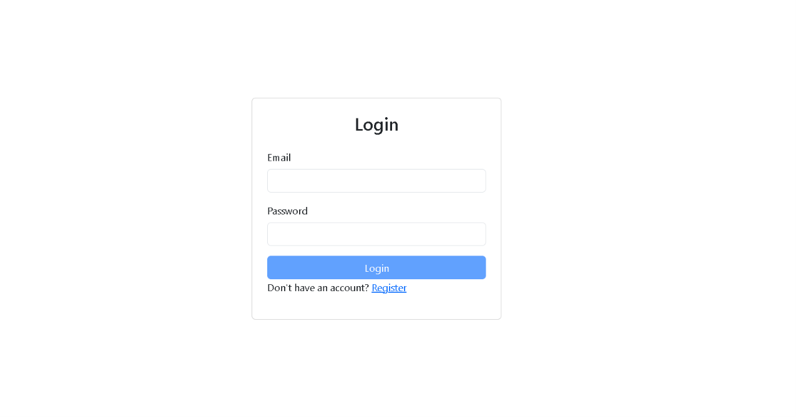
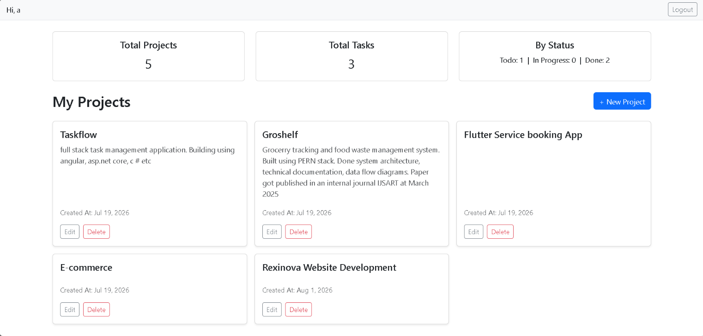
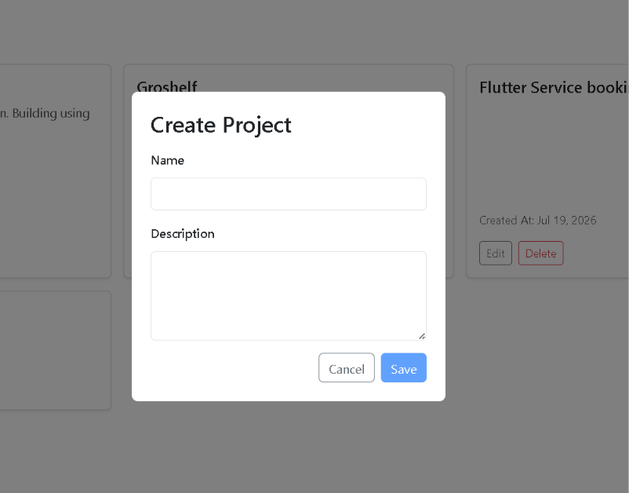
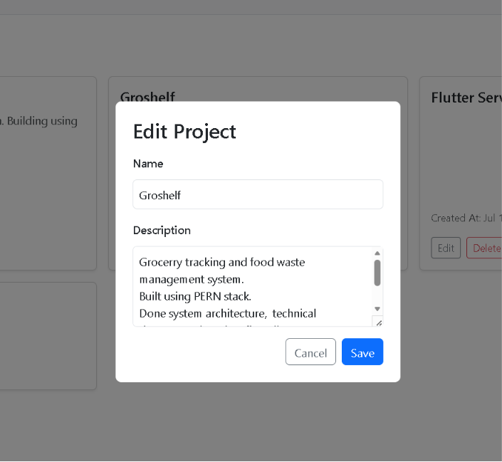
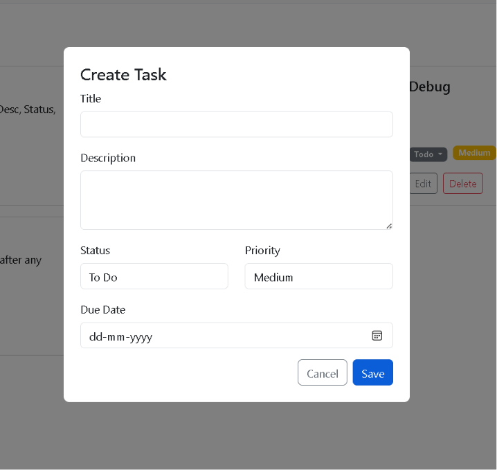

# TaskFlow — Task & Project Management App

A full-stack web application for managing personal projects and tasks, 
built with Angular, ASP.NET Core Web API, and SQL Server.

---

## 🚀 Features

- User authentication with JWT (register, login, logout)
- Create, edit, and delete Projects
- Responsive, card-based dashboard UI (Bootstrap)
- Route guards with token-expiry checks — protected routes redirect to login automatically
- Auth interceptor auto-attaches JWT to API requests and handles 401s by logging out
- Task management API (priority, status, due dates) — backend complete, frontend in progress

---

## 🛠️ Tech Stack

**Frontend:** Angular, Bootstrap, TypeScript  
**Backend:** C# ASP.NET Core Web API (.NET 8)  
**Database:** SQL Server, Entity Framework Core  
**Authentication:** JWT (JSON Web Tokens)  
**Tools:** Visual Studio, VS Code, Postman, Git

---

## 📸 Screenshots

### Login Page


### Dashboard


### Task List


### Project Board



### Task Board


---

## ⚙️ How to Run Locally

### Prerequisites
- .NET 8 SDK
- SQL Server
- Node.js and Angular CLI (`npm install -g @angular/cli`)

```bash
npm install -g @angular/cli
```

### Backend
1. Clone the repo: `git clone https://github.com/rubeenavs/taskflow` 
2. Navigate to `TaskManager.API/`
3. Update the connection string in `appsettings.json` with your SQL Server details
4. Run migrations: `dotnet ef database update`
5. Start the API: `dotnet run`

### Frontend
1. Navigate to `taskflow-client/`
2. Install packages: `npm install`
3. Start the dev server: `ng serve`
4. Open browser at `http://localhost:4200`

Other useful commands:
- `ng build` — creates a production build in the `dist/` folder
- `ng test` — runs unit tests via Karma
- `ng generate component <name>` — scaffolds a new component

---

## 📡 API Endpoints

| Method | Endpoint | Description |
|--------|----------|-------------|
| POST | /api/auth/register | Register new user |
| POST | /api/auth/login | Login and receive JWT |
| GET | /api/projects | Get all projects |
| POST | /api/projects | Create project |
| PUT | /api/projects/{id} | Update project |
| DELETE | /api/projects/{id} | Delete project |
| GET | /api/projects/{id}/tasks | Get tasks in a project |
| POST | /api/projects/{id}/tasks | Create task |
| PUT | /api/tasks/{id} | Update task |
| DELETE | /api/tasks/{id} | Delete task |

---

## 🏗️ Backend Architecture

The backend follows a layered structure with clear separation between data, business logic, and API responses.

### Authentication & Authorization
- JWT-based authentication — users receive a signed token on login/register
- Passwords hashed with BCrypt before storage
- `[Authorize]` applied at the controller level, so protected endpoints reject unauthenticated requests before any code runs

### Ownership-Based Access Control
- Every Project and Task request is scoped to the logged-in user via their JWT claims
- A dedicated `GetOwnedProjectAsync()` check ensures users can only access, edit, or delete their own projects and tasks
- Tasks use nested routing (`/api/projects/{projectId}/tasks`) with two-level ownership validation — both the project and the task within it are checked against the requesting user

### DTOs & Validation
- Request and response DTOs keep the API surface clean — clients only send/receive what's necessary (e.g. `projectId` and `userId` are never user-supplied; they come from the URL and JWT respectively)
- Data annotations (`[Required]`, `[MaxLength]`, etc.) validate incoming DTOs via `ModelState`
- Invalid requests return `400 Bad Request` with field-level error details before touching the database

### Error Handling
- Try-catch blocks around database operations handle server/connection-level failures separately from validation errors
- Consistent error responses across controllers (`400` for validation, `404`/`403` for ownership violations, `500` for unexpected failures)

### Database
- Entity Framework Core with SQL Server, using code-first migrations
- Core entities: `Users`, `Projects`, `Tasks` — with a one-to-many relationship from User → Projects → Tasks

---

## 🎨 Frontend Architecture

### Auth Flow
- Reactive Forms for Login and Register, with client-side validation
- JWT stored client-side; `AuthService` decodes the payload to read username and check expiry
- Functional route guard (`CanActivateFn`) blocks access to `/dashboard` and `/projects` for expired or missing tokens, redirecting to `/login`
- Functional HTTP interceptor attaches the JWT to outgoing requests and handles `401` responses by logging out and redirecting

### Dashboard & Projects
- `ProjectService` handles all CRUD calls to the API
- Dashboard renders projects in a responsive Bootstrap card grid, with loading, error, and empty states handled via Angular's `@if`/`@for` control flow
- A reusable `ProjectModal` component handles both Create and Edit via a shared form, styled with Bootstrap form controls
- Custom `.pm-backdrop` / `.pm-content` classes handle modal positioning and overlay — scoped separately from Bootstrap's own `.modal` classes to avoid style collisions

---

## 👩‍💻 About

Built by **Rubeena** — BTech Computer Science graduate, .NET Full Stack Developer.  
[LinkedIn](https://www.linkedin.com/in/rubeena-vs) | [GitHub](https://github.com/rubeenavs) | [Email](mailto:rubeenavs.it@gmail.com)
